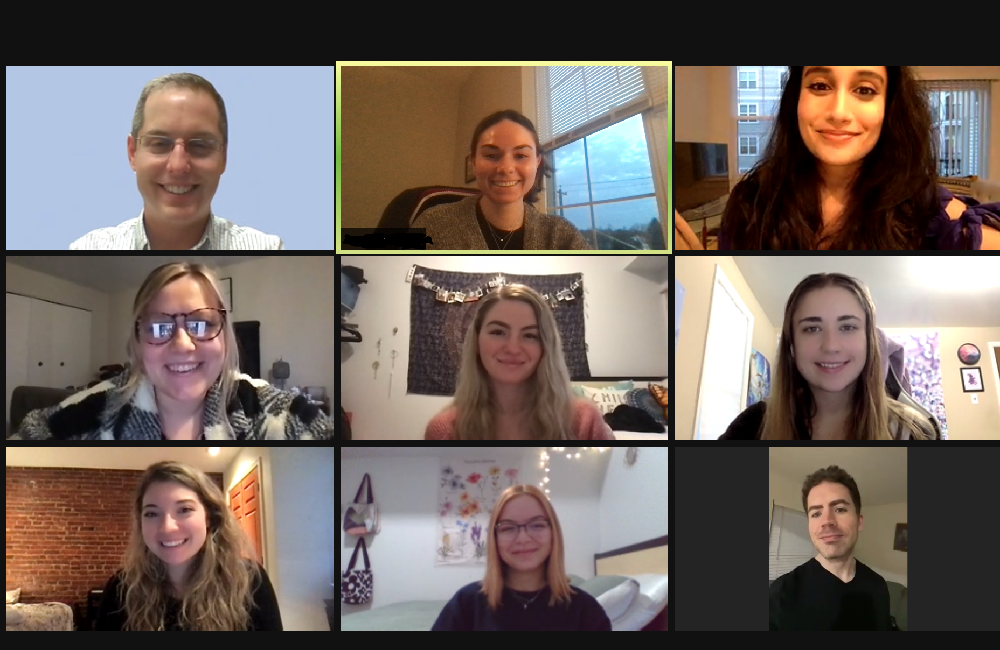
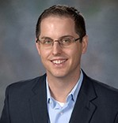
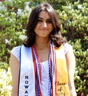
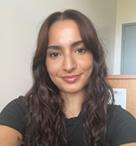
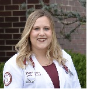
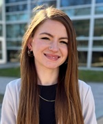

 

 
 

# **Faculty**

 

 

**Steven M. Brunwasser, Ph.D.,** is an Assistant Professor in the [Department of Psychology](https://csm.rowan.edu/departments/psychology/index.html) at Rowan University and an Adjunct Research Assistant Professor of Medicine at [Vanderbilt University Medical Center](https://medicine.vumc.org/). He received his doctoral degree in Psychology from the University of Michigan in 2012 and completed a T32 Postdoctoral Fellowship at Vanderbilt University. 

* [Rowan Faculty Profile](https://csm.rowan.edu/departments/psychology/facultystaff/psychology_full_part/brunwasser.html)
* [GoogleScholar Profile](https://scholar.google.com/citations?user=fTbkJLYAAAAJ&hl=en)
* [National Library of Medicine Bibliography](https://www.ncbi.nlm.nih.gov/myncbi/1XeVsqj5Kl-QR/bibliography/public/)

 
 

# **Graduate Trainees**

 

**Nicole Kelso, MA,**  is a fifth-year PhD candidate in the Rowan University Clinical Psychology PhD program. She received a B.S. in Psychology from Virginia Polytechnic and State University and a M.P.S in Clinical Psychological Sciences from the University of Maryland College Park. She is currently on internship at Mount Sinai Hospital in New York City. Her current research interest is depression prevention during periods of life transitions, and her dissertation focuses on improving depression prevention strategies during the transition into college.

 

**Anisha Satish, MA, PMH-C,** is a fourth-year doctoral candidate in the Rowan University Clinical Psychology Ph.D. program. She received her B.S. in Psychology from St. Bonaventure University. After graduating, she worked at the Mayo Clinic, contributing to research evaluating the impact of uterine fibroids and hysterectomy on mental health outcomes. Her current research interests are in dissemination and implementation science, with a particular focus on improving the reach and effectiveness of prevention-focused interventions for perinatal depression.

 

**Allison Warner, MS,** is a third-year doctoral student in the Rowan University Clinical Psychology PhD program. She received a B.A. in Psychology from Rutgers University – New Brunswick and a M.S. in Psychology from Villanova University. Prior to returning to graduate school and joining the PrevSci lab, Allison worked in health and educational equity program management. Her current research interests are broadly within the area of the developmental origins of health and disease, particularly how perinatal stress influences childhood risk for developing inflammatory illnesses.

 

# **Recent Graduates**

 

**Ashleigh D'Cruz, BS,** is a Rowan University alumna with a B.S. in Biological Sciences and a minor in Psychology. She is dedicated to pursuing medical school, with aspirations of becoming a pediatrician or psychiatrist. Outside the lab, she previously volunteered as an EMT for her local EMS agency, where she developed a strong commitment to helping others. She hopes to gain valuable research experience in prevention science to learn more about promoting health and well-being. 

 

**Kathryn Brennan**

 

# **Undergraduate Trainees**

 

**May Sukkarieh** is a second-year undergraduate student working to receive her B.S. in Psychological Sciences. She is minoring in Law and Justice Studies. May hopes to gain valuable research experience and to learn more about youth depression and other important topics.

 

**Peter Wyatt** is a psychology undergraduate who is in his senior year. Alongside his major, he has a concentration in Behavioral Neuroscience. As an aspiring researcher, Peter hopes to gain experience in better understanding preventative methods for issues that relate to both the mental and the physical. Following graduation, Peter plans to pursue a Master's in Neuroscience. Through the PrevSci Lab, he hopes to develop a foundation in the understanding of how prevention can easily be the first step before other conditions follow.

 

# **Lab Alumni**

 

**Rachel Odland, DO,** earned her doctoral degree from the Rowan University School of Osteopathic Medicine in 2024. She received a B.S. in Psychology from University of Massachusetts-Amherst in 2018. Throughout her undergraduate education, Rachel worked as a Research Assistant studying alexithymia, specifically analyzing the effects of aging on emotion regulation. Her current research interests include perinatal mental health and the psychoneuroimmunology of pregnancy and postpartum. In the PrevSci Lab, she contributed to a [paper](https://pubmed.ncbi.nlm.nih.gov/38779997/) published in *Nicotine & Tobacco Research* characterizing mothers who began using electronic cigarettes during pregnancy and subsequent health outcomes. 

 

**Samantha Mindlin, DO,** earned her doctoral degree from the Rowan University School of Osteopathic Medicine in 2024. In the PrevSci Lab, she contributed to a [paper](https://pubmed.ncbi.nlm.nih.gov/38779997/) published in *Nicotine & Tobacco Research* characterizing mothers who began using electronic cigarettes during pregnancy and subsequent health outcomes. 

 

**Brook Matthews, BS** recently graduated from Rowan with a major in Psychological Sciences and was a recipient of the College of Science and Mathematics [Dean's Outstanding Senior Award (DOSA)](https://csm.rowan.edu/news/student-awards/dosa/2023dosa.html). She has since moved on to the Master of Science in Clinical Mental Health Counseling program at Rutgers University. 

 

**Camila Mira** graduated as a Psychology major from Rowan University. She is from Brazil and joined our team in 2020 as a research assistant. Camila was one of several trainees from our lab to win the Best Poster Award at the Rowan Psychology Undergraduate Research Conference. 

